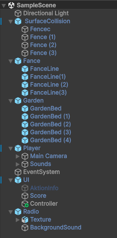

# Морковная ферма

Использованная версия Unity: 6000.1.7f1

[Сборка для Windiws](https://drive.google.com/file/d/1DPgFObkayoJOQG_ZqitgFJL-On33u3JX/view?usp=sharing)

Проект представляет из себя мини-игру, где целью является посадка,
выращивание и сбор моркови.

Содержит одну сцену:



#### Игрок

На данный момент пользователь может перемещаться на WASD и осматириваться с помощью мыши и взаимодействовать с грядками на ПКМ. Объект Controller имеет следующий скрипт, содержащий следующие функции:

```c#
public Vector3 GetMoveDirection(){...}
//Возвращает направление, куда желает двигаться пользователь

public Vector3 GetRotateDirection(){...}
//возвращает направление поворота

public bool GetAktionButton(){...}
//true если ПКМ нажата
```

объект Player запрашивает значения данных функций и исходя из данных выполняет соответствующие действия.

#### Грядка
Т.к. текстура испозуемая для отображения грядки имеет небольшой размер, во время запуска проекта грядка создает необходимое количество копий данной текстуры (далее каждая такая копия будет иминоваться тайлом). Тайл содержит скрипт, заменяющий его текстуру при необходимости. Грядка обращается к данному скрипту при: 

+ Посадке моркови
+ Её росте
+ Сборе

#### Забор
Так же как и грядка создает необходимое количество копиий собственной текстуры. Не даёт игроку покинуть пределы локации.

#### Радио
Декоративный объект. Воспроизводит фоновую музыку.

#### Интерфейс
Содержит информацию о количестве собранной моркови и отоброжает возможность взаимодействия с грядкой.
